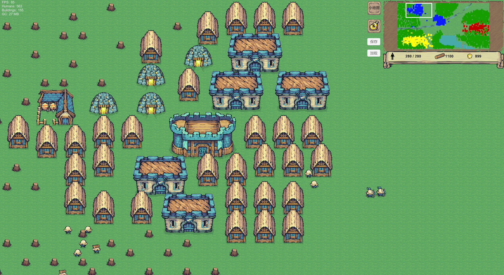
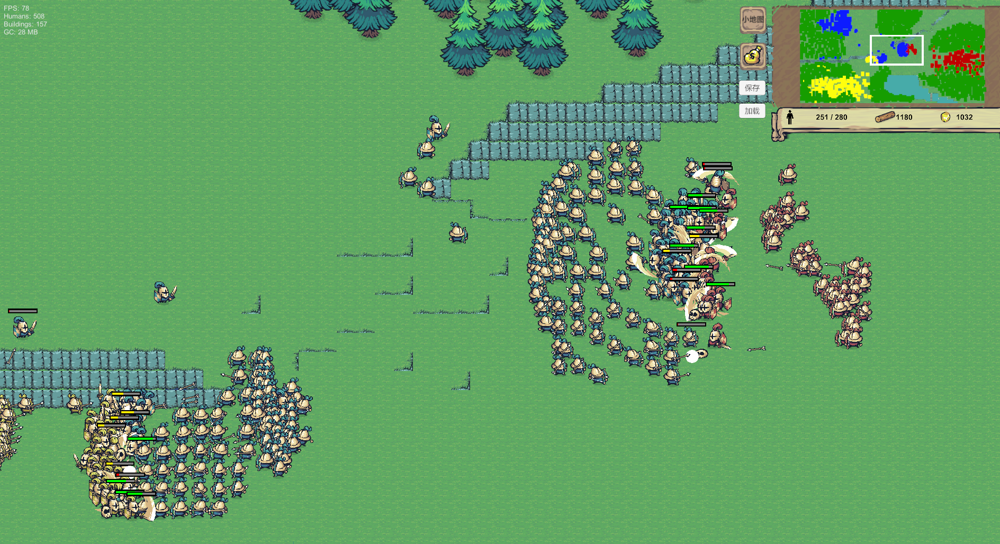

# **Unity 2D RTS Gameplay Demo**

演示视频：https://www.bilibili.com/video/BV1KCwtzyEWZ

一个基于 Unity 开发的 2D RTS 核心玩法 Demo，实现了**单位 AI、建筑建造、单位生产、小地图交互、资源采集与战斗等** RTS 基础系统。

 **项目重点实现 RTS 场景下的多单位寻路系统，包括 A* 寻路算法、寻路请求调度、分帧寻路计算与动态障碍处理。**

项目截图：

#### 核心特性

✔ 自实现 A* 寻路系统  
✔ RTS 单位 AI 行为系统（FSM）  
✔ 寻路请求调度与分帧计算  
✔ Tilemap 双层网格系统  
✔ RTS 小地图系统  
✔ World Snapshot 存档系统  

#### 核心功能

##### 单位系统

\- 单位选择（单选 / 框选）

\- 单位指令分发（根据单位类型）

\- 单位移动
\- 单位攻击
\- 单位采集资源

#####  建筑系统

\- 建筑建造
\- 建筑生产单位
\- 建筑资源交互

##### 单位AI

\- 基于 **FSM** 的单位行为系统
\- 支持移动 / 攻击 / 采集

\---

##### 寻路系统

项目使用 **自实现 A\*** 寻路算法 + 单位AI逻辑。

特点：

\- 优先队列优化 OpenList
\- BFS 搜索最近可站立节点
\- 协程分帧寻路
\- 每帧限制寻路节点数量

支持：

\- 动态障碍检测
\- 单位占位
\- 寻路请求调度

**核心代码**：

Assets/Scripts/PathFinding    

Assets/Scripts/Unit/Humans/AI.cs

**寻路调度系统**

Assets/Scripts/PathFinding/PathRequestController.cs

为了避免大量单位同时发起寻路导致帧率波动，实现了**寻路请求队列调度**系统：

\- 使用 Queue 管理寻路请求
\- 通过 Dictionary 实现请求去重
\- 限制每帧处理的寻路请求数量
\- 配合协程A*进行分帧寻路计算

\-------------------------

**网格系统**

基于 Tilemap 构建双层网格：

Tile -> 建筑 + 迷雾逻辑

SubTile -> 寻路节点（每个 Tile 进一步细分为多个子节点用于路径计算）

**RTS 小地图系统**

功能：

\- 小地图实时渲染
\- 点击小地图移动主摄像机
\- 小地图视野框同步

**存档系统**

Assets/Scripts/Save

\-采用 **World Snapshot Save** 的方式，将游戏世界状态统一序列化到 `SaveGameRoot` 根对象中。

\-结构：

SaveGameRoot
  ├ factions
  ├ units
  ├ buildings
  ├ groups
  ├ resources

\---

\# 技术栈

Unity  / C#  / Tilemap  / A* Pathfinding  / FSM  / ScriptableObject  / Object Pool  / NewtonsoftJson

\---

**项目说明：**

该项目为个人学习 RTS 系统架构与寻路算法的实践 Demo。